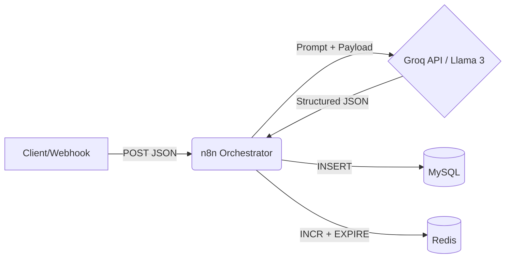

# AI-Powered Real-Time Sentiment Analysis Pipeline

An event-driven data pipeline built to capture, analyze, and store customer reviews in real-time. This project demonstrates advanced system design principles by integrating webhook triggers, asynchronous orchestration, Large Language Models (LLMs), persistent storage, and in-memory caching via a fully containerized Docker architecture.

## Architecture & Systems Design

The system is designed to decouple data ingestion from data processing, ensuring high availability and preventing memory leaks or database locks during traffic spikes.

